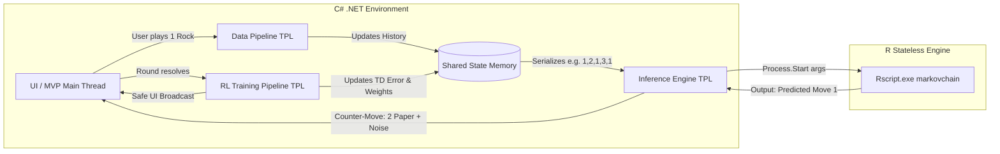

# RESEARCH ML WITH VECTOR
## Architectural Research & Concurrency Rationale

The architecture of this simulated Reinforcement Learning environment is heavily anchored in the Task Parallel Library (TPL) and its Dataflow components. By utilizing TPL Dataflow, the system establishes a robust, actor-based pipeline for the Data Engineering phase. Rather than blocking the main execution thread while processing the user's input, the architecture implements a producer-consumer model through in-process message passing. This ensures that state transitions and data ingestion are handled asynchronously as soon as the data becomes available, maintaining a perfectly fluid and non-blocking game interface regardless of the mathematical computations occurring in the background.

Implementing this level of continuous concurrency introduces the critical challenge of shared memory management. In this system, the training pipeline continuously updates the mathematical weights of the state vector while the inference pipeline simultaneously reads those values to determine the next move. Without proper synchronization, this concurrent access would inevitably trigger race conditions and silent data corruption. Therefore, this C# architecture demands strict state protection. To achieve this, optimized synchronization primitives, such as `ReaderWriterLockSlim`, are deployed to safeguard the state vector. This ensures data integrity during write operations without bottlenecking the rapid read operations required by the inference engine.

Furthermore, the design consciously avoids the performance degradation associated with over-parallelization. While the TPL provides powerful abstractions like `Parallel.For` for data parallelism, applying them to mathematically lightweight iterations—such as updating a compact vector containing a fixed three-position baseline—creates severe architectural overhead. The CPU cost of partitioning the data and synchronizing worker threads for such a microscopic payload would actively slow down execution. Consequently, the system intentionally eschews data parallelism in favor of task parallelism. It isolates the core operations into distinct, long-running concurrent tasks (data ingestion, training, and inference) rather than attempting to parallelize the micro-computations within those loops.

Finally, this strict concurrent separation dictates the absolute boundaries of how background processes interact with the presentation layer. A fundamental constraint of multithreaded design is that invoking non-thread-safe instance methods—such as manipulating graphical components directly from a background worker—will immediately trigger cross-thread operation exceptions. When constructing the interface, particularly in event-driven UI frameworks, background pipelines calculating the TD error or Mean Squared Error cannot push updates directly to the screen. To maintain a robust and thread-safe MVP, all background metrics are broadcasted strictly via asynchronous events and carefully marshalled back to the main UI synchronization context, ensuring the mathematical simulation remains entirely decoupled from the presentation layer.

### Discrete-Time Markov Chain (DTMC) Heuristic Baseline

Before introducing the simulated Reinforcement Learning weights, the system establishes a baseline predictive model utilizing a Discrete-Time Markov Chain (DTMC). Because we are engineering this environment from scratch in C# without relying on external statistical libraries (such as R's `markovchain` or specialized math software), the fundamental stochastic mechanics must be implemented manually in memory.

**The Stochastic Transition Matrix (TM)**
At the core of the heuristic pipeline is a square stochastic matrix $P$ where each entry $p_{ij}$ represents the probability that the user, currently playing state $s_i$, will transition to state $s_j$ in the next round. The system relies on the core Markov property: the assumption that the probability $p_{ij}$ depends entirely on the current state rather than the distant historical sequence. To maintain validity, the data engineering pipeline must ensure that all row probabilities sum exactly to 1.

**Real-Time Maximum Likelihood Estimation (MLE)**
As the user plays, the Data Pipeline continuously captures the state transitions. To keep the model lightweight and fast, the transition matrix is dynamically estimated in real-time using a Maximum Likelihood Estimator (MLE) approach. The C# producer-consumer queue updates the transition counts $n_{ij}$ (the number of times the user transitioned from state $i$ to state $j$). The transition probability is thus calculated continuously.

**Inference and Counter-Move Prediction**
During the inference phase, the AI must predict the user's next action to select the optimal counter-move. Given the user's current state $X_{t}=s_{j}$, the C# Inference Engine queries the $j$-th row of the transition matrix. The engine selects the mode of this conditional distribution—identifying the highest probability $p_{ij}$—and uses it as the predicted user move to execute its counter-strategy.

## Online Learning & Progressive Vector Mechanics

Unlike traditional machine learning models that require massive pre-existing datasets to function, this system implements **Online Learning**. The model learns "on-the-fly", meaning its intelligence and prediction accuracy scale progressively with every iteration of the game.

### 1. The 100-Position State Vector
The core of the AI's memory is a dynamically updated vector with a maximum capacity of 100 positions. It represents the AI's short-to-medium-term memory of the human player's behavior. 
At the start of the execution, the vector is completely empty. Each index records a specific user move mapped to a numerical value:
* `1` = Rock
* `2` = Paper
* `3` = Scissors

Crucially, the 100-size limit is a **capacity ceiling**, not a requirement to start playing. The algorithm uses a dynamic pointer to track exactly how many positions contain valid data.

### 2. Simulated Training & The 3-Position Baseline
The simulated training is an iterative process that begins immediately, but the inference engine requires a minimum **Baseline** of data to calculate a valid Markov transition.

* **Rounds 1 to 3 (Baseline Phase):** The human plays, and the C# Data Pipeline simply collects the inputs without attempting intelligent predictions (the AI plays randomly). The vector populates sequentially:
  * *Round 1:* Human plays Rock (`1`) $\rightarrow$ Vector: `[1, 0, 0, 0...]`
  * *Round 2:* Human plays Paper (`2`) $\rightarrow$ Vector: `[1, 2, 0, 0...]`
  * *Round 3:* Human plays Rock (`1`) $\rightarrow$ Vector: `[1, 2, 1, 0...]`
* **Round 4 Onwards (Active Inference Phase):** The vector now contains enough sequential data to form a Discrete-Time Markov Chain (DTMC). The C# engine begins serializing the populated segment of the vector (e.g., `[1, 2, 1]`) and delegating it to the R script. As rounds progress, this segment grows, rendering the statistical predictions increasingly robust.

### 3. Markov Strategy & Counter-Move Prediction
To predict the next move, the R engine looks at the human's last action and searches the populated vector for historical precedents—specifically, what the human played *immediately after* that action in the past.

**Practical Example (Round 4):**
Assume the current vector state is `[1, 2, 1]` and the human just played Rock (`1`) in Round 3.
1. The R engine traverses the memory looking for instances of `1`.
2. It finds a `1` at index `0`. The subsequent move at index `1` was a `2` (Paper).
3. It finds another `1` at index `2`, but as it is the latest move, there is no subsequent data yet.
4. Based on this limited transition matrix, the engine calculates a 100% historical probability that the user transitions from `1` (Rock) to `2` (Paper). 

The R script outputs: *"Predicted user move: 2"*. The C# Inference Engine receives this, deduces the optimal counter-move, and selects **Scissors (`3`)**.

> **Note on Epsilon-Greedy Policy:** During early rounds (e.g., Rounds 4-10) where data is scarce, the mathematical prediction is highly susceptible to noise. The AI applies an Epsilon-Greedy exploration parameter to occasionally inject random counter-moves, preventing the AI from becoming entirely predictable while the vector builds a reliable sample size.

### 4. The 100-Round Limit: Circular Memory (Ring Buffer)
To prevent memory overflow and allow the AI to adapt to changing human strategies, the vector implements a **Sliding Window (Ring Buffer)** approach once it reaches its 100-round capacity.

At Round 101, the system does not crash or reset. The C# Data Pipeline simply dequeues the oldest historical move (at index `0`), shifts all remaining data backwards, and enqueues the newest move at index `99`. This ensures the R engine always calculates the Markov transition probabilities based on the user's 100 most recent actions, effectively allowing the AI to "forget" obsolete behavioral patterns.

## Reinforcement Learning

Reinforcement Learning (RL) is a branch of ML that focuses on how agents can learn to make decisions through trial and error to maximize cumulative rewards. RL allows machines to learn by interacting with an environment and receiving feedback based on their actions. Unlike supervised learning, which relies on a training dataset with predefined answers, RL involves learning through experience. 

### Simulated RL Pipeline & Heuristic Vector-Based Learning
In this architecture, rather than deploying heavyweight ML frameworks or training deep neural networks, we implement a simulated RL pipeline. The system utilizes heuristic, vector-based learning by directly updating numerical weights within a dedicated state vector. This background process mimics an optimization algorithm, continuously adjusting scoring parameters dynamically as the application executes.

* **Reward Function Implementation:**
To drive this continuous learning loop, the system relies on a simulated reward function. A long-running background `Task` evaluates the agent's actions and applies this function directly to the vector's parameters. For example, assigning a +1 reward for a win and a -1 penalty for a loss. This allows the model's policy to adapt on the fly.

* **Error Measurement (Raw Math Integration):**
Evaluating the performance of our heuristic learning relies on calculating simulated Temporal Difference (TD) error and Mean Squared Error (MSE). Crucially, these metrics are computed using raw mathematical logic derived from the vector's expected outcome versus the actual outcome after each state transition. This ensures accurate error measurement without introducing dependencies on external machine learning libraries.

* **Concurrency and Thread-Safe Memory Management:**
Because the simulated learning loop updates vector scores continuously in the background while the inference engine reads them, strict memory protection is required to prevent data corruption. The architecture implements thread-safe memory locks, specifically leveraging `ReaderWriterLockSlim`. This synchronization primitive ensures that the vector values are updated safely without throwing concurrency exceptions, seamlessly maintaining the non-blocking nature of the game loop.

## Windows Forms MVP Interface & Asynchronous Game Loop
### 1. Executive Summary & Objective
The purpose of this technical investigation is to define the architecture and implementation strategy for Phase 4: MVP Interface & Asynchronous Game Loop within a C# Windows Forms (.NET) application.

The primary objective is to deliver a responsive, user-facing Minimum Viable Product (MVP) interface that captures user input, displays game outcomes, visualizes real-time performance metrics (specifically Temporal Difference (TD) error and Mean Squared Error (MSE)), and provides secondary analytical views for AI rate models—all while maintaining an uninterrupted, non-blocking UI thread.

### 2. Core Functional Requirements

* **Interactive State & Outcome Rendering:** Capture real-time user inputs, process them through the execution pipeline, and render continuous simulation/game state updates.
* **Real-Time Analytical Graphics:** Plot dynamic TD error and MSE curves as the backend simulation progresses.
* **AI Model Inspection (Emerged Windows):** Provide modular, secondary window views (e.g., dedicated diagnostic windows) to inspect AI rate models and internal policy distributions without halting primary simulation cycles.
* **Asynchronous & Non-Blocking Architecture:** Decouple the UI thread from computational workloads (AI evaluations, loss calculations, data streaming) to avoid interface freezing or frame drops.

### 3. Concurrency & Pipeline Architecture
#### 3.1. Threading Paradigms (async/await & IProgress<T>)

* **Asynchronous Game Loop:** Game ticks, agent decision cycles, and gradient updates must execute inside worker tasks via Task.Run() or dedicated loop runners managed by CancellationTokenSource.
* **Thread-Safe Telemetry Dispatch:** Direct cross-thread control manipulation violates Windows Forms thread safety (InvalidOperationException). UI updates must be marshaled using Progress<T> / IProgress<T> or event dispatchers synchronized with the UI thread context.

#### 3.2. Dataflow Pipeline Pattern (TPL Dataflow)
To structure data exchange between background simulation tasks and the UI layer, the architecture leverages the Task Parallel Library (TPL) Dataflow model (System.Threading.Tasks.Dataflow).

* **Actor/Message-Passing Model:** Data points (raw states, reward signals, model updates) are posted into pipeline blocks rather than handled through tightly coupled method invocations.
* **Background Processing (TransformBlock<TInput, TOutput>):** Computes TD errors, MSE variations, and metric aggregations across pooled worker threads.
* **UI Synchronization (ActionBlock<TInput>):** Terminal blocks bound to TaskScheduler.FromCurrentSynchronizationContext() handle GUI elements, chart updates, and emerged inspection windows directly on the UI message loop without manual Control.Invoke() calls.
* **Flow Control & Cancellation:** Conditional routing (LinkTo with predicates) handles valid simulation metrics and operational cancellations via CancellationToken.

### 4. Visualization & Component Strategy

* High-Performance Charting (TD Error & MSE):
    * ScottPlot (ScottPlot.WinForms): Recommended for streaming signal data and real-time scatter/line rendering with minimal CPU overhead.
    * Standard Charting (System.Windows.Forms.DataVisualization.Charting): Alternative option utilizing FastLine series with data point batching.

* Emerged Windows (AI Rate Model View):
    * Non-modal child forms instantiated via form.Show(this) or dockable analytical panels.
    * Subscribed to the metric stream to display updated weights, rate curves, and decision boundaries independently of the primary game window.
 
### 5. Technical Implementation Matrix

| Component | Technical Objective | Recommended C# / WinForms Mechanism | Concurrency Strategy |
| :--- | :--- | :--- | :--- |
| **Async Game Loop** | Continuous execution of game mechanics and simulation cycles | `async Task RunGameLoopAsync(CancellationToken ct)` | Background worker thread (`Task.Run`) |
| **TD Error & MSE Computation** | Real-time calculation of reinforcement learning loss / error metrics | `TransformBlock<RawStepData, MetricTelemetry>` | TPL Dataflow worker threads |
| **Graphic Renderer** | Dynamic plotting of TD error and MSE curves | `ScottPlot.FormsPlot` / `Chart (FastLine)` | Synchronized UI `ActionBlock` or `IProgress<T>` |
| **Emerged AI Rate Window** | Dedicated diagnostic window for AI model metrics | Non-modal Form (`Show()`) with custom viewport | Event subscription via UI Synchronization Context |
| **Input Ingestion** | Capture user actions and enqueue them for simulation processing | `Channel<UserInput>` or `ConcurrentQueue<UserInput>` | Producer-Consumer thread-safe queue |
| **Pipeline Interruption** | Responsive stopping, resetting, or pausing of simulation | `CancellationTokenSource.Cancel()` | Cooperative token checking within loop |
